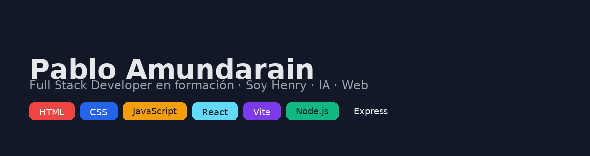

  

<!-- Encabezado animado -->
<h1 align="center">👋 ¡Hola! Soy Pablo Amundarain</h1>
<h3 align="center">💻 Full Stack Developer en formación | Estudiante en Soy Henry</h3>

  

---

### 💡 Sobre mí  
🎓 Actualmente estudio en el Bootcamp **Soy Henry**, donde desarrollo proyectos Full Stack con JavaScript, React y Node.js.  
💡 Me apasiona combinar **lógica, diseño y creatividad** para construir experiencias web completas.  
🚀 Interesado en **IA aplicada al desarrollo web** y en seguir creciendo como programador.

---

### 🧰 Tecnologías que manejo  

#### 🖥️ Frontend  

#### ⚙️ Backend  

#### 🧩 Otras herramientas  

---

### 🚀 Proyectos destacados  

| Proyecto | Descripción | Tecnologías |
|-----------|--------------|--------------|
| [**PM1 Portfolio**](https://github.com/amundarainp/pm1-portfolio) | Portfolio del módulo 1 con IA y LocalStorage | HTML · CSS · JS |
| [**PM2 Películas**](https://github.com/amundarainp/pm2-peliculas) | Catálogo dinámico con Bootstrap y API pública | HTML · JS · Bootstrap |
| [**Plantilla Web**](https://github.com/amundarainp/plantilla-web) | Base para nuevos proyectos con ESLint/Prettier | Node · NPM |

---

### 📊 Estadísticas  

  
  

---

### 📫 Contacto  

📧 **Correo:** [amundarainp@gmail.com](mailto:amundarainp@gmail.com)  
💼 **LinkedIn:** [Pablo Amundarain ] www.linkedin.com/in/pablo-amundarain-b65b33a9
  
🌐 **Portfolio:** [amundarainp.github.io](https://amundarainp.github.io)

---

⭐ *“El mejor código es el que cuenta una historia clara.”*
